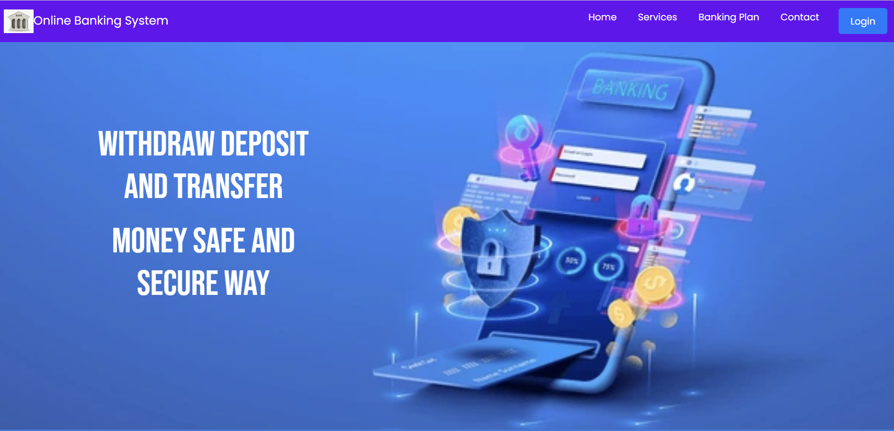
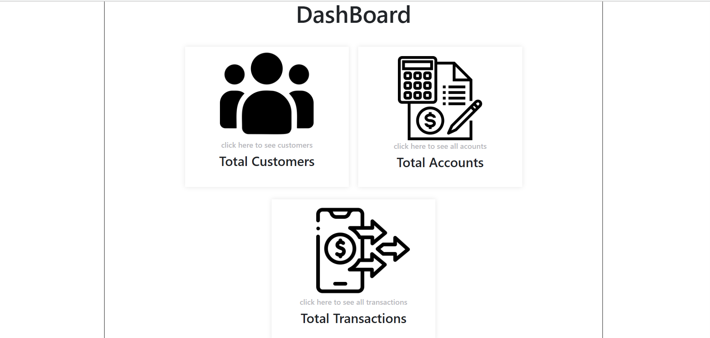
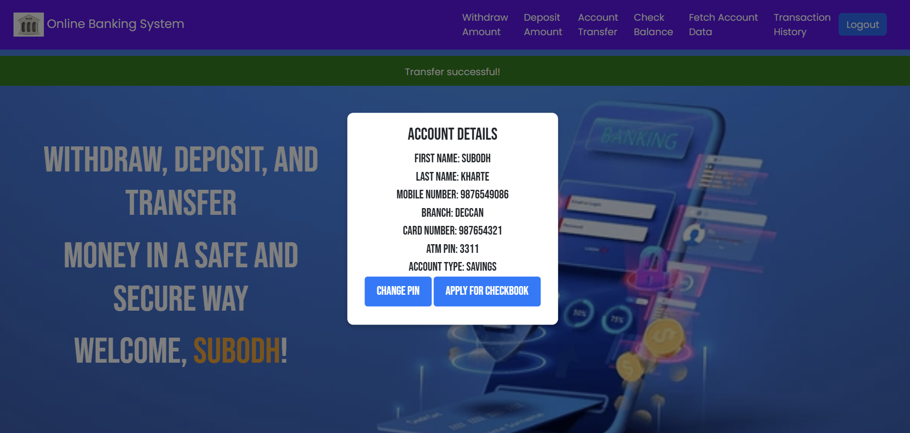

# Online Banking System

## Description
The Online Banking System is a web-based application that allows users to manage their bank accounts, transfer funds, and view transaction history. It is built using Java Servlets, MySQL, and HTML/CSS/JavaScript.

## Features
- **User Authentication**: Users can register and log in securely.
- **Account Management**: Users can create and manage bank accounts.
- **Fund Transfers**: Users can transfer funds between accounts.
- **Transaction History**: Users can view their transaction history.
- **Admin Panel**: Admins can manage users and accounts.

## Technologies Used
- **Backend**: Java Servlets, Apache Tomcat.
- **Frontend**: HTML, CSS, JavaScript.
- **Database**: MySQL.
- **Tools**: Eclipse IDE, MySQL.

## Screenshots





## Setup Instructions
1. **Clone the repository**:
   ```bash
   git clone https://github.com/ItsOmkara/online-banking-system.git
